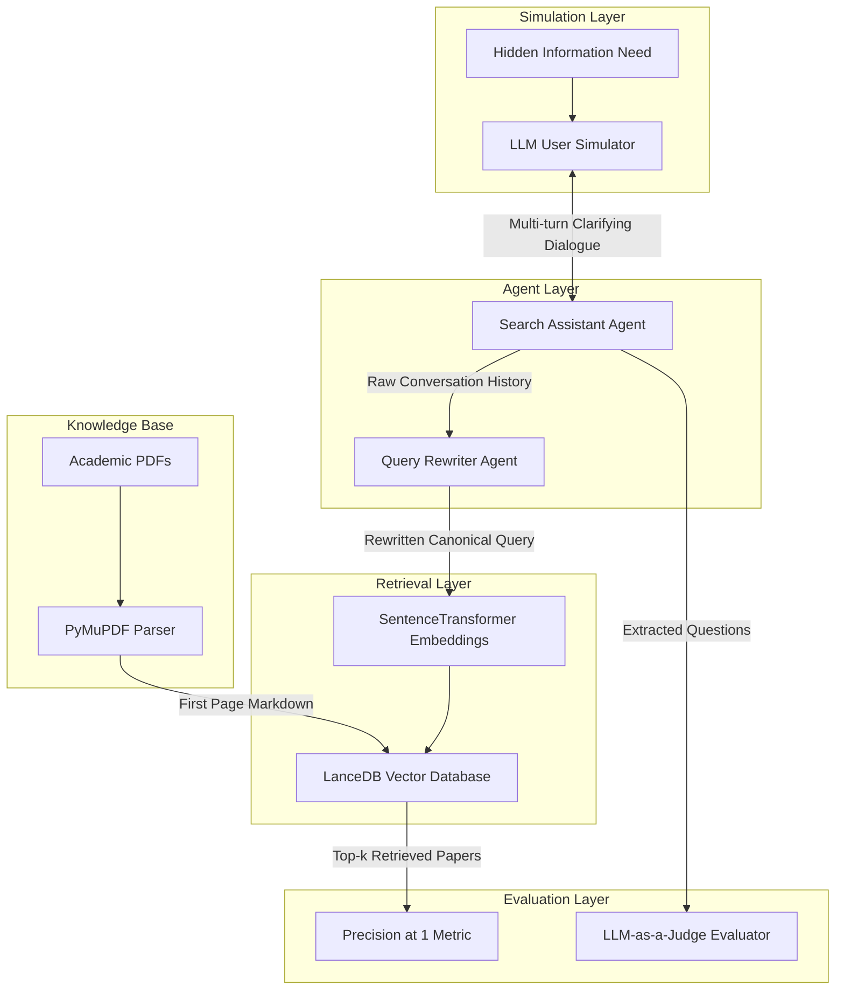

<div align="center">
  
</div>

---

# Agentic Conversational Information Retrieval (CIR) and Academic Search System

This framework represents an advanced **Conversational Information Retrieval (CIR)** framework. By leveraging Large Language Models (LLMs) to simulate human researchers, orchestrate multi-turn clarifying dialogues, and autonomously rewrite search queries, the system dramatically improves retrieval precision over traditional semantic search methodologies.

<div align="left">
  <a href="https://www.python.org/"></a>
  <a href="https://jupyter.org/"></a>
  <a href="https://www.langchain.com/"></a>
  <a href="https://openai.com/"></a>
  <a href="https://lancedb.github.io/lancedb/"></a>
  <a href="https://huggingface.co/BAAI/bge-small-en-v1.5"></a>
  <a href="https://pymupdf.readthedocs.io/"></a>
  <a href="#"></a>
  <a href="https://opensource.org/licenses/MIT"></a>
</div>

## Abstract
Traditional keyword-based semantic search often fails to capture the complex, nuanced information needs of researchers, suffering from vocabulary gaps and polysemy. This project introduces an Agentic AI solution that replaces standard search with an interactive dialogue system. The system dynamically simulates user personas, asks targeted clarifying questions, and rewrites the accumulated conversation history into a highly dense canonical query. Validated against a corpus of academic papers, the query rewriting approach increases Precision@1 (P@1) from a baseline of 50% to 95%.

## Table of Contents
1. [Overview](#overview)
2. [Key Features](#key-features)
3. [System Architecture](#system-architecture)
4. [Methodology and Agent Workflow](#methodology-and-agent-workflow)
   - 4.1. [Document Parsing and Vectorization](#document-parsing-and-vectorization)
   - 4.2. [LLM-Based User Simulation](#llm-based-user-simulation)
   - 4.3. [Context-Aware Query Rewriting](#context-aware-query-rewriting)
5. [Evaluation and Metrics](#evaluation-and-metrics)
   - 5.1. [Retrieval Performance Comparison](#retrieval-performance-comparison)
   - 5.2. [LLM-as-a-Judge Framework](#llm-as-a-judge-framework)
6. [Tools and Technologies](#tools-and-technologies)
7. [Project Structure](#project-structure)
8. [Installation](#installation)
9. [Environment Variables](#environment-variables)
10. [License](#license)
11. [Author](#author)
12. [Support](#support)

## Overview
This project solves the ambiguity of short user queries in academic literature search. Instead of executing a search immediately, an LLM-powered Search Assistant engages the user in a multi-turn dialogue to extract latent constraints (e.g., specific algorithms, publication years, baseline comparisons). Once the intent is fully resolved, a secondary Agent rewrites the dialogue into a highly optimized search query, which is embedded and matched against a LanceDB vector store of academic papers.

---

## Key Features
* **Agentic Dialogue Orchestration:** Autonomous generation of clarifying questions based on search context.
* **LLM User Simulation:** Automated testing pipeline using LLMs prompted with hidden user personas and specific information needs.
* **Intelligent Query Rewriting:** Compression of noisy multi-turn conversations into dense, structured queries for semantic retrieval.
* **Dense Vector Search:** High-speed semantic similarity matching using LanceDB and `BAAI/bge-small-en-v1.5` embeddings.
* **LLM-as-a-Judge Evaluation:** Automated quality assessment of generated dialogues validated against human annotation using Fleiss' Kappa.
* **Automated PDF Parsing:** Strategic extraction of high-density semantic signals from the first pages of academic papers using PyMuPDF4LLM.

---

## System Architecture
The system architecture separates the conversational interaction from the retrieval engine, utilizing dedicated LLM agents for simulation, conversation, and query optimization.



### Architectural Components
| Layer | Responsibility |
|---------|---------------|
| **Simulation Layer** | Mimics realistic researcher responses based on predefined JSON personas to test the system autonomously. |
| **Agent Layer** | Orchestrates the dialogue to extract constraints and rewrites the history into a semantic-friendly format. |
| **Retrieval Layer** | Encodes texts using `bge-small` and performs rapid vector similarity search. |
| **Knowledge Base** | Parses and indexes the most informative sections (Title, Abstract, Introduction) of the academic corpus. |

---

## Methodology and Agent Workflow

### Document Parsing and Vectorization
To minimize noise from references and empirical tables, `pymupdf4llm` extracts text strictly from the first page of 108 academic papers. These texts are vectorized using the highly-ranked `BAAI/bge-small-en-v1.5` model and ingested into a local LanceDB instance.

### LLM-Based User Simulation
To evaluate the system without human-in-the-loop bottlenecks, an LLM acts as the user. Prompted with a specific `information_need` profile (e.g., "Looking for cross-lingual transfer learning for low-resource languages"), the simulator naturally answers the Search Assistant's questions without hallucinating data outside its persona.

### Context-Aware Query Rewriting
Raw conversational history inherently contains semantic noise (e.g., greetings, filler words). The Query Rewriter module synthesizes this multi-turn dialogue into an explicit string that aligns perfectly with the linguistic structure of academic abstracts, serving as the ultimate input for the Vector DB.

---

## Evaluation and Metrics

### Retrieval Performance Comparison
The effectiveness of the Conversational IR system was evaluated using the **Precision@1 (P@1)** metric across 20 simulated researcher personas.

| Strategy | Average P@1 | Correct Retrievals |
| :--- | :---: | :---: |
| **Baseline (Initial Short Query)** | 0.50 (50%) | 10 / 20 |
| **Context-Aware (Raw Conversation)** | 0.85 (85%) | 17 / 20 |
| **Optimized (Rewritten Query)** | **0.95 (95%)** | **19 / 20** |

*The query rewriting approach yields a **+45% absolute improvement** over baseline semantic search.*

### LLM-as-a-Judge Framework
To ensure the Search Assistant generates high-quality clarifying questions, an evaluation pipeline was implemented comparing Human annotations against LLM judgments on four criteria:
1. Naturalness
2. Relevance
3. Usefulness
4. Overall Quality

**Inter-Rater Reliability:** Measured using **Fleiss' Kappa**, the evaluation showed *Excellent* agreement (0.81) for the "Usefulness" metric, confirming that automated LLMs are highly reliable judges for conversational search utility.

---

## Tools and Technologies

| Component | Purpose / Library |
| -------------------- | ------------------------------- |
| **LLM Orchestration** | OpenAI API (GPT Models), LangChain |
| **Vector Storage** | LanceDB |
| **Embedding Model** | SentenceTransformers (`BAAI/bge-small-en-v1.5`) |
| **Document Processing**| PyMuPDF4LLM, PyMuPDF |
| **Evaluation Metrics**| Scikit-learn, Statsmodels (Cohen's & Fleiss' Kappa) |
| **Data Manipulation** | Pandas, Numpy |

---

## Project Structure

```text
Agentic-CIR-Conversational-Search-System/
│
├── conversational_search_pipeline.ipynb   # Main workflow and implementation
│
├── data/
│   ├── users.json                         # 20 Simulated user personas and intents
│   └── papers/                            # 108 Scientific PDFs (Dataset)
│
├── papers_lancedb/                        # LanceDB Vector Database
│
├── outputs/
│   ├── conversations.csv                  # Logged agent-user dialogues
│   ├── rewritten_queries.csv              # Outputs from the Query Rewriter
│   └── evaluation_results.json            # Human vs. LLM-as-a-Judge scores
│
├── requirements.txt                       # Project dependencies
└── README.md
```

---

## Installation

### Clone Repository
```bash
git clone https://github.com/farzadjannati/Agentic-CIR-Conversational-Search-System.git
cd Agentic-CIR-Conversational-Search-System
```

### Create Environment
```bash
conda create -n conv-search python=3.10
conda activate conv-search
```

### Install Dependencies
```bash
pip install -r requirements.txt
```

---

## Environment Variables
Create a `.env` file in the root directory to securely store your API keys:

```env
OPENAI_API_KEY=YOUR_OPENAI_API_KEY
# Optional: Set base URL if using a custom endpoint/provider
OPENAI_API_BASE=https://api.avalai.ir/v1
```

---

## License
This project is licensed under the MIT License.

---

## Author

**Farzad Jannati**  
M.Sc. Student, University of Tehran  
Research Assistant @ Social Networks Lab  

**Research Interests:** NLP, Large Language Models (LLMs), Agentic AI, Retrieval-Augmented Generation (RAG), Information Retrieval  

📧 [farzadjannati@ut.ac.ir](mailto:farzadjannati@ut.ac.ir) | 💻 [github.com/farzadjannati](https://github.com/farzadjannati) | 💼 [linkedin.com/in/farzadjannati](https://www.linkedin.com/in/farzadjannati)

---

## Support
If you find this research or implementation useful, please consider giving the repository a star ⭐

---

<p align="center">
  Built with ❤️ using LangChain, OpenAI, LanceDB, and SentenceTransformers
</p>
